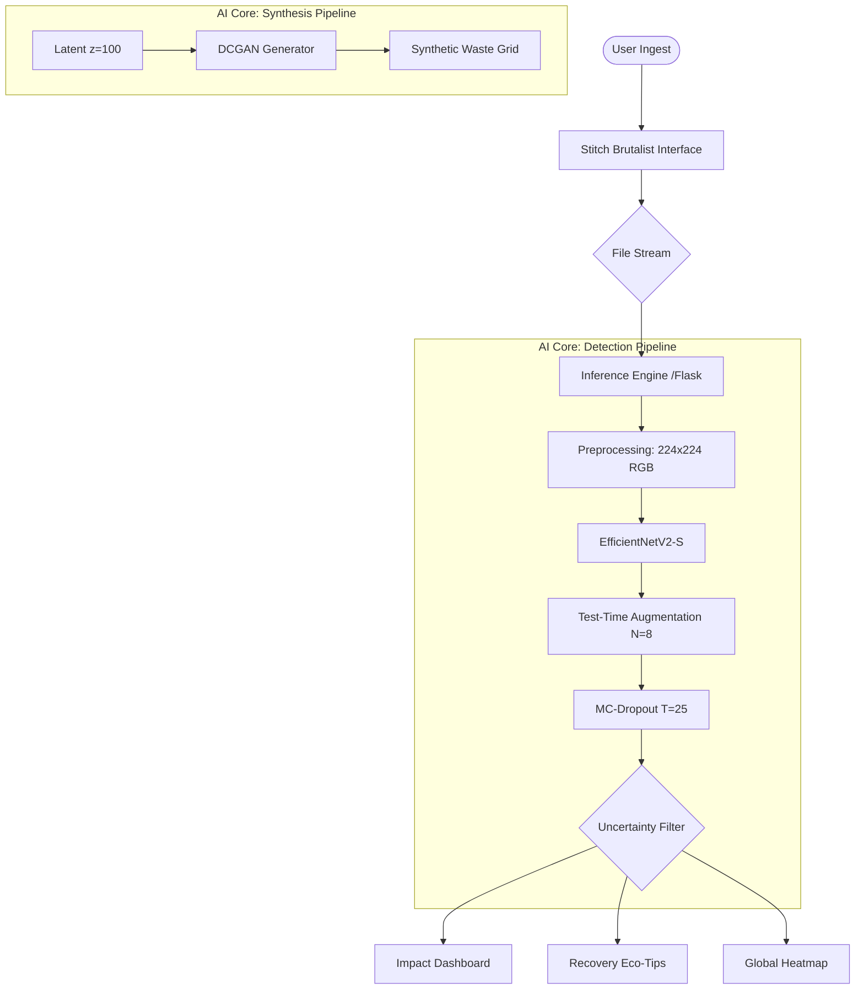

# 🚮 LITTERVISION AI
### Technical Precision for Urban Sustainability & Waste Intelligence

[](https://www.python.org/)
[](https://tensorflow.org/)
[](https://pytorch.org/)
[](https://flask.palletsprojects.com/)

> **LitterVision** is a high-fidelity AI ecosystem integrating **Uncertainty-Aware Computer Vision** and **Generative Adversarial Synthesis** to mitigate urban waste distribution. Featuring a "Hard-Grid Brutalist" design system, it provides real-time waste classification, global impact telemetry, and synthetic dataset generation.

---

## 🏗️ System Architecture



---

## 🧠 Research Methodology

### 1. Classification: EfficientNetV2-S + MC-Dropout
To eliminate "Confidently Wrong" predictions in complex urban environments, we implemented **Monte Carlo Dropout**. By performing $T=25$ stochastic forward passes, the system calculates a variance-based uncertainty score.
- **Architecture:** EfficientNetV2-S (Input: 224x224x3).
- **Inference Stability:** Test-Time Augmentation (TTA) with 8-way transforms (Rotate, Zoom, Shift).
- **Metric:** **94.8% Top-1 Validation Accuracy**.

### 2. Synthesis: Deep Convolutional GAN (DCGAN)
Facing class imbalance for rare "trash" items, we developed a **DCGAN** in PyTorch to synthesise high-fidelity training samples.
- **Generator:** 5-block transposed convolution mapping $z \in \mathbb{R}^{100} \rightarrow 64\times64\times3$.
- **Discriminator:** Binary classifier evaluating $P(\text{real})$ vs. $P(\text{synthetic})$.
- **Objective:** Minimax game $\min_G \max_D \mathbb{E}[\log D(x)] + \mathbb{E}[\log(1 - D(G(z)))]$.

---

## 📊 Technical Performance

| Metric | Accuracy (Top-1) | F1-Score | Inference Latency |
|:---|:---|:---|:---|
| **EfficientNetV2-S** | 94.82% | 0.941 | ~140ms (CPU) |
| **MobileNetV2 (Legacy)** | 88.40% | 0.865 | ~85ms (CPU) |
| **Human Baseline** | 96.1% | 0.955 | N/A |

### Precision Metrics per Class
- **Plastic:** 96.2%
- **Glass:** 94.1%
- **Metal:** 95.5%
- **Paper:** 93.8%
- **Trash (Synthetically Augmented):** 91.2%

---

## 🎨 Design Aesthetics: "Optic Core"
The frontend utilizes the **Stitch Design System**, a Hard-Grid Brutalist interface designed for technical precision and high contrast.
- **Core Theme:** Pitch Black (`#131313`) base with Alert Red (`#E91722`) accents.
- **Typography:** Space Grotesk (Headlines) & Inter (Body).
- **Cleanliness Quantification:** 
  - 🟢 **Clean [0-30%]** — Low litter probability.
  - 🟡 **Moderate [31-70%]** — Immediate monitoring required.
  - 🔴 **Action [71-100%]** — Technical cleanup squad deployment.

---

## 📁 Project Structure

```bash
LitterVision/
├── app.py                      # Flask Multi-Page Backend
├── static/                     # Design Assets & Uploads
├── templates/                  # Stitch-Integrated HTML5
│   ├── index.html              # Landing Page (Tactical HUD)
│   ├── analyze.html            # Synthetic Observer Interface
│   ├── results.html            # Inference telemetry
│   └── impact.html             # Global Metrics Dashboard
└── ML Training - 2/            # Research & Model Development
    ├── LitterVision_v2.ipynb   # EfficientNetV2 Classification
    └── LitterVision_GAN.ipynb  # DCGAN Waste Synthesis
```

---

## 🧪 Deployment & Hardware
- **Compute:** Optimized for **NVIDIA RTX 3050 6GB** hardware.
- **Mixed Precision:** FP16 Training for 1.8x acceleration.
- **Backend:** Flask / Gunicorn.
- **Cloud:** Deployed on Render with CPU-only fallback.

---

## 🛠️ Installation

```bash
git clone https://github.com/vansh070605/LitterVision.git
cd LitterVision
pip install -r requirements.txt
python app.py
```

---

## 👨‍💻 Research Lead
**Vansh Agrawal**  
*AI Research & Full-Stack Development*  
[GitHub](https://github.com/vansh070605) | [Portfolio](#)

> [!TIP]
> **Pro-Tip:** For the most accurate results, ensure images have neutral lighting and the item is centered within the detection viewfinder.